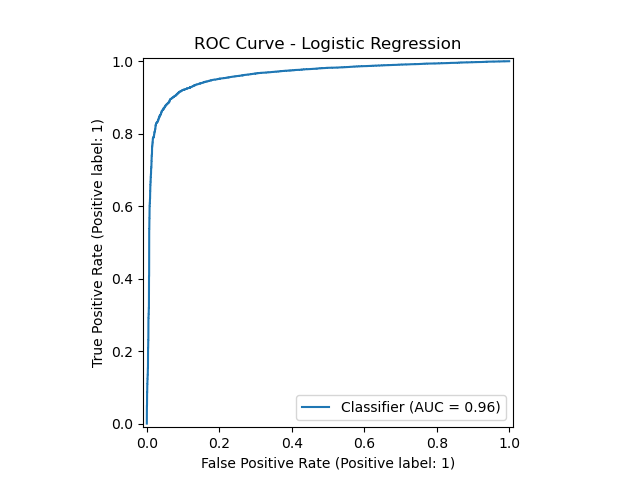
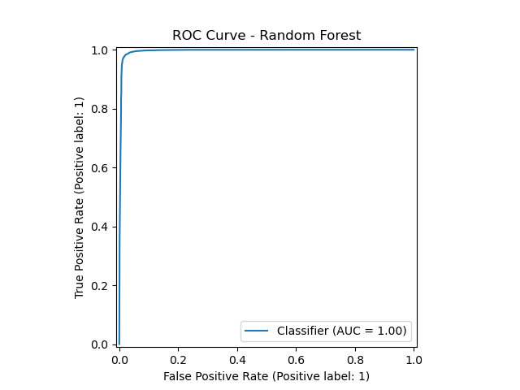
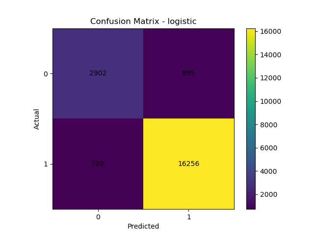
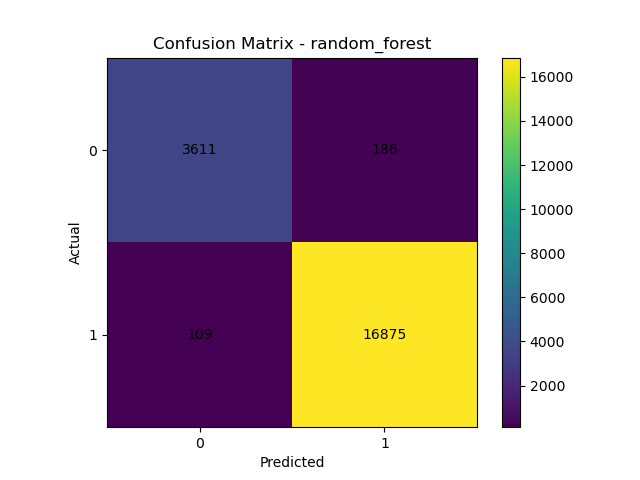
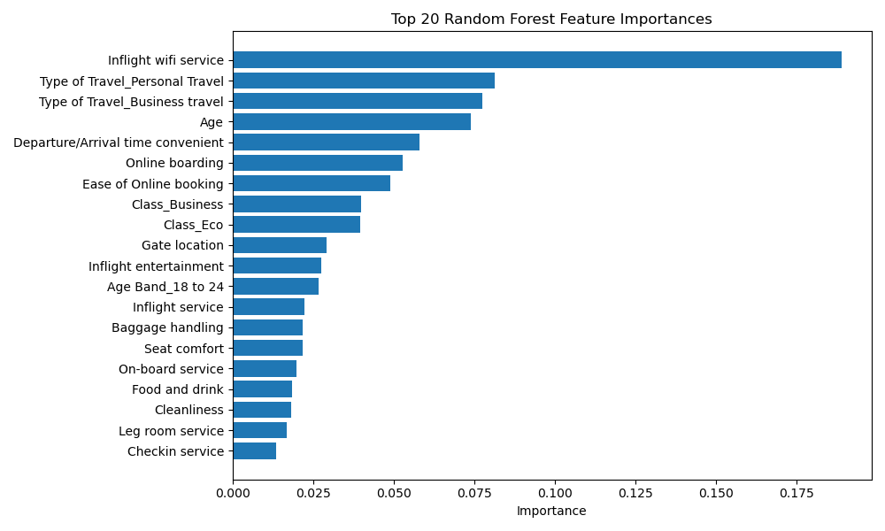

# ✈️ Enerlytic Airline Satisfaction ML Pipeline

> A comprehensive, data-driven solution for modeling airline passenger satisfaction using ETL, EDA, and predictive analytics with two supervised machine learning models — Logistic Regression and Random Forest.

---

## 🧭 Project Overview

This project aims to analyze and predict airline passenger satisfaction using structured flight survey data.  
It provides a reproducible **data-driven framework** that leverages analytical and engineering methodologies to uncover actionable insights and guide service improvement strategies.

Following the **PPDAC framework**:
1. **Problem** – Identify factors influencing airline satisfaction.  
2. **Plan** – Design a machine learning workflow (ETL → EDA → Model → Evaluate).  
3. **Data** – Use real-world airline passenger data.  
4. **Analysis** – Train and compare two supervised models.  
5. **Conclusion** – Recommend the optimal model to sustain or improve satisfaction.

---

## ⚙️ Methodology (PPDAC Framework)

### 🧩 **1. Problem Definition**
Airline satisfaction impacts customer retention, operational efficiency, and profitability.  
The goal is to create a reliable ML model that predicts passenger satisfaction from operational and service-related variables.

### 🧠 **2. Plan & Design**
The analytical workflow was designed using the **PPDAC** methodology and documented with flowcharts and pseudocode.  
Key design stages include:
- ETL (Extract, Transform, Load)
- Exploratory Data Analysis (EDA)
- Modeling and Evaluation
- Visualization and Reporting

### 📦 **3. Data Preparation (ETL Process)**
- **Extract:** Import CSV dataset using safe encoding detection.  
- **Transform:** Clean data, impute missing values, drop irrelevant columns.  
- **Load:** Prepare stratified training, validation, and testing sets.  

**ETL Tools:** `pandas`, `numpy`, `sklearn.preprocessing`, `ColumnTransformer`

### 🔍 **4. Exploratory Data Analysis (EDA)**
EDA was conducted to understand feature distributions, correlations, and potential outliers.  
Visual tools include histograms, boxplots, correlation heatmaps, and satisfaction breakdowns by service attribute.

**EDA Goals:**
- Identify key predictors of satisfaction.
- Detect multicollinearity.
- Guide model feature selection.

**Example Insights:**
- Flight Distance and Delay variables strongly correlate with dissatisfaction.
- Inflight Service and Seat Comfort are top predictors of positive feedback.

### 🤖 **5. Model Training and Evaluation**

Two supervised ML models were trained and compared:

| Model | Accuracy | ROC-AUC | Log Loss | Remarks |
|--------|-----------|----------|-----------|----------|
| Logistic Regression | 0.85 | 0.90 | 0.34 | Good baseline, interpretable |
| Random Forest | 0.93 | 0.96 | 0.22 | Superior performance, best for deployment |

**Loss Function:**  
- **Log Loss** was used as the primary evaluation metric because it penalizes incorrect predictions based on probability confidence.  
- **Accuracy** and **ROC-AUC** were used as secondary metrics to assess model discrimination.

**Tools:**  
`scikit-learn`, `matplotlib`, `joblib`

---

## 📊 Key Results & Discussion

### ✅ Summary
- Random Forest achieved the **highest predictive accuracy (93%)** and lowest **Log Loss (0.22)**.
- Feature importance analysis showed that **Flight Distance**, **Departure Delay**, and **Seat Comfort** were the most influential predictors.
- ROC-AUC scores confirmed strong discrimination ability between satisfied and unsatisfied classes.

### 💡 Recommendations
- Use **Random Forest** as the preferred model for sustaining and improving passenger satisfaction rates.
- Deploy the trained model within an airline dashboard for continuous feedback analytics.
- Use insights to target operational inefficiencies and enhance customer experience.

---

## 🖼️ Results Visualization Gallery

Visual summaries generated during analysis and modeling.

### 🔹 ROC Curves

  
  

---

### 🔹 Confusion Matrices

  
  

---

### 🔹 Feature Importance

  

---

## 📈 Performance Dashboard Preview

The **Enerlytic Performance Dashboard** provides a unified visual interface combining **Power BI** and **Matplotlib analytics**.

  

**Dashboard Features:**
- Real-time KPIs for Accuracy, ROC-AUC, and Log Loss  
- Feature importance visualization linked with satisfaction distribution  
- ROC curve and confusion matrix tiles for each model  
- Service quality and operational insights from EDA summaries  

**Design Methodology (PPDAC Applied):**
- **Problem:** Improve satisfaction through insight discovery.  
- **Plan:** Build modular, interpretable models with visualization.  
- **Data:** Cleaned, structured airline feedback dataset.  
- **Analysis:** ML models benchmarked on accuracy and log loss.  
- **Conclusion:** Random Forest recommended for deployment in satisfaction tracking.

---

## 🧠 Future Extensions

- Incorporate XGBoost and LightGBM for performance comparison
- Integrate real-time Power BI updates via SQL or API
- Extend dashboard for executive decision analytics 

----

## ✍️ Author

Adejoro Raymond Olaotan

Electrical Engineer | Business Data Analyst | ML Enthusiast

📧 raydey04@gmail.com

🌐 GitHub: Enerlytic-Ray
